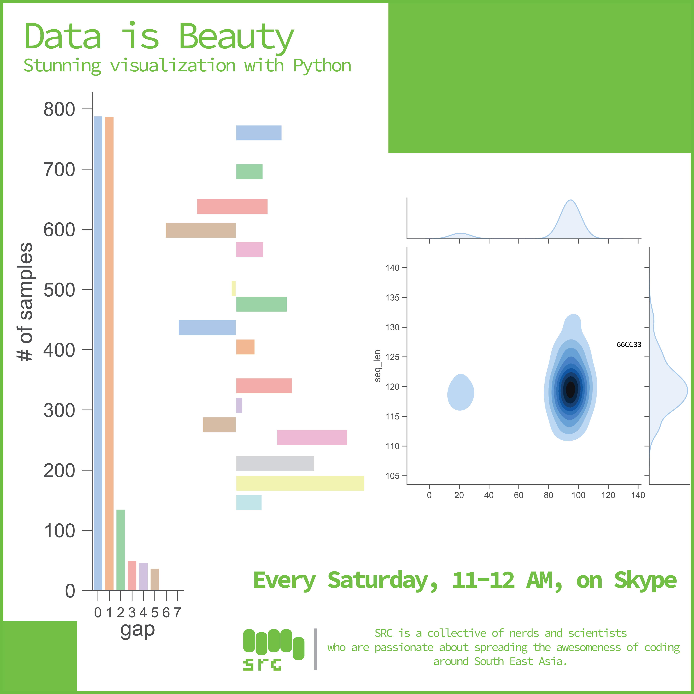

# Welcome to Data is Beauty--a microcourse on visualization with Python

**In this course you will learn:**

* Python (basic)
* Pandas (basic)
* Matplotlib (basic)
* Seaborn (basic)

**Operating systems**

* If you are rocking linux/Mac OS you are all set 
* Windows users please install the [Windows Subsystem for Linux](https://docs.microsoft.com/en-us/windows/wsl/install-win10)
* 

